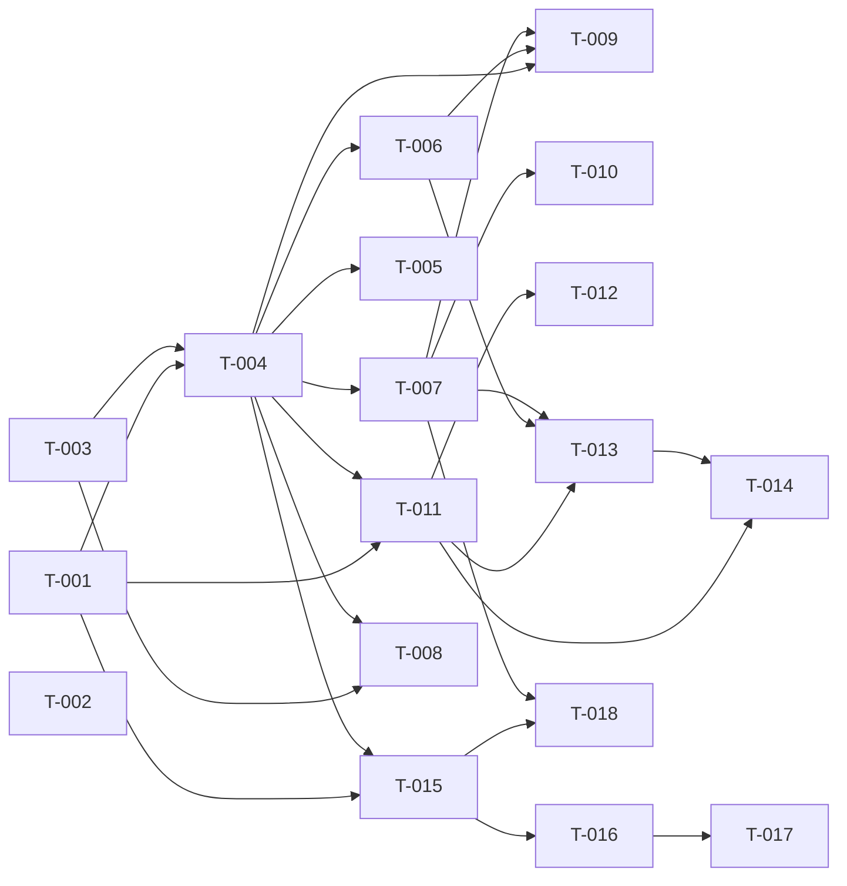

> **Project-scoped site.** This file shares `context/plans/` with the separate
> **alpha-publish** `build-site.md` (do not conflate them). `/ck:make` for **this**
> project (self.code-eval Piston wiring) runs against the self.code-eval checkout at
> `self.ai/self.ai/self.code-eval/`, decomposed from the three `cavekit-piston-*` /
> `cavekit-code-eval-*-seam` kits only.

# Build Site

self.code-eval Piston wiring — 18 tasks across 5 tiers, decomposed from 13 requirements / 40 acceptance criteria over 3 domain kits (piston-execution-client, code-eval-multiple-seam, code-eval-python-seam). 100% AC coverage (40/40). Build target: the `self.code-eval` submodule (read-only reference here) plus the code-eval Flux manifest in the self.ai backend repo. The requirement-level soft cycle (client R2 ⇄ R4/R5) is dissolved at task granularity: the core execute-contract task (T-004) lands first, then resource-sizing / timeout-retry / metadata layer onto it — no circular task edges. Multiple-seam and python-seam depend only on the client and carry **no** task edge on each other; multiple-seam is sequenced first by value/risk per the treasuremap (advisory, not a dependency).

## Tier 0 — No Dependencies (Start Here)

| Task | Title | Cavekit | Requirement | Effort |
|------|-------|---------|-------------|--------|
| T-001 | Add code-eval's own opt-in config surface: `ENABLE_PISTON_EXECUTION` (default False) + `PISTON_BASE_URL` (default `http://piston.self-theseus.svc.cluster.local:2000`), read via the service's own env-read pattern (mirror `os.getenv` usage in `api/main.py`), NOT the backend `config.py:782,788` pair | piston-execution-client | R1 | S |
| T-002 | Declare both env vars (default off) in the code-eval Flux manifest `manifests/eval/code-eval.yaml` (self.ai backend repo), alongside the existing `CODE_EVAL_*` env pattern | piston-execution-client | R1 | S |
| T-003 | Language-name resolution client module: map each harness token → Piston **invocable** name + version, derived from/validated against `GET /api/v2/runtimes` (not `packages.txt`); handle `gcc`→c/c++ and `dotnet`→csharp/fsharp/basic aliasing; unresolved token raises a clear named error before any request | piston-execution-client | R3 | M |

## Tier 1 — Depends on Tier 0

| Task | Title | Cavekit | Requirement | blockedBy | Effort |
|------|-------|---------|-------------|-----------|--------|
| T-004 | Core execute contract: POST Piston v2 `/api/v2/execute` with source, stdin, resolved language+version (via T-003), `resources`, `run_timeout`; parse response into a result exposing stdout, stderr, exit code, and signal as distinct fields | piston-execution-client | R2 | T-001, T-003 | M |

## Tier 2 — Depends on Tier 1

| Task | Title | Cavekit | Requirement | blockedBy | Effort |
|------|-------|---------|-------------|-----------|--------|
| T-005 | Error-signal path: flag on + unreachable/bad `PISTON_BASE_URL` surfaces a clear connection/error signal, never a silent 0-score indistinguishable from a genuine test failure | piston-execution-client | R1 | T-004 | S |
| T-006 | Per-language resource sizing `{cpu, ram, appDisk}`, configurable per language (not one global constant); compiled defaults (C#, Rust, Java) strictly larger than interpreted on ≥1 of cpu/ram/appDisk; parse and flag exit-137 / SIGKILL as distinct from a normal non-zero exit | piston-execution-client | R4 | T-004 | M |
| T-007 | `run_timeout` per-language (no per-request raise above Piston's 3000 ms global cap) + exactly-one cold-start retry: a first-attempt transient timeout retries once (call-count assertable); a persistent timeout yields a timeout result distinct from failure and from success | piston-execution-client | R5 | T-004 | M |
| T-008 | Reproducibility metadata: record the resolved Piston runtime version per executed language and a marker distinguishing a Piston-backed execution from an in-container one | piston-execution-client | R6 | T-003, T-004 | S |
| T-011 | Opt-in routing at the MultiPL-E seam `multiple_metrics/containerized_eval.py:45` (`eval_string_script`): flag off → byte-identical local `safe_subprocess`/`Popen` path (`safe_subprocess/__init__.py:41`); flag on → route via the Piston client; decision reads code-eval's own `ENABLE_PISTON_EXECUTION` | code-eval-multiple-seam | R1 | T-001, T-004 | M |
| T-015 | Opt-in routing for the Python `exec()` engines at `execute.py:76` (`check_correctness`), `pal_metric/python_executor.py:69`, `beyond_eval.py:196+`: flag off → unchanged `reliability_guard()`+`multiprocessing.Process`+signal-timeout path; flag on → route via the Piston client; decision reads code-eval's own `ENABLE_PISTON_EXECUTION` | code-eval-python-seam | R1 | T-001, T-004 | M |

## Tier 3 — Depends on Tier 2

| Task | Title | Cavekit | Requirement | blockedBy | Effort |
|------|-------|---------|-------------|-----------|--------|
| T-009 | `[needs-live-endpoint]` Live smoke: a known-good Python program that prints `42` returns stdout `42` and exit 0 through the client end-to-end against the live theseus Piston endpoint | piston-execution-client | R2 | T-004, T-006, T-007 | S |
| T-010 | `[needs-live-endpoint]` Live cold-start retry validation: a cold first invocation of a runtime that succeeds on the second attempt yields a scored result, not a 0 on the untried first attempt | piston-execution-client | R5 | T-007 | S |
| T-012 | Executor coverage gate: enumerate the exact **19** executor-backed languages validated against live `eval_*.py` files (cpp, cs, d[eval_dlang], go, java, javascript, julia, lua, perl[eval_pl], php, python, r, racket, ruby, rust, scala, sh, swift, ts); routing an executor-less language (clojure/dart/elixir/haskell/ocaml) raises a clear named error, distinguishable from a genuine 0-score test failure | code-eval-multiple-seam | R3 | T-011 | S |
| T-013 | Per-language timeout + resource pass-through at the MultiPL-E seam: harness per-problem timeout → client `run_timeout`; per-language resource budget applied end-to-end (`[needs-live-endpoint]` compiled budget observable in the execute `resources`); cold-start timeout retried once via the client, not scored 0 | code-eval-multiple-seam | R4 | T-011, T-006, T-007 | M |
| T-016 | `[needs-human-review]` Candidate+test assembly spike + implementation: combine candidate program and its test string into one self-contained Piston script (no separate importable candidate module), with exit code and/or stdout deterministically encoding pass vs. fail, mapped back to the harness's existing pass/fail result | code-eval-python-seam | R2 | T-015 | L |
| T-018 | Timeout parity for the exec() seam: per-problem signal timeout → client `run_timeout` with equivalent ceiling semantics (`[needs-live-endpoint]` an infinite-loop candidate reported as timeout/fail, not a hang); cold-start timeout retried once via the client, not scored 0 | code-eval-python-seam | R3 | T-015, T-007 | S |

## Tier 4 — Depends on Tier 3

| Task | Title | Cavekit | Requirement | blockedBy | Effort |
|------|-------|---------|-------------|-----------|--------|
| T-014 | `[needs-live-endpoint]` Scoring parity at the MultiPL-E seam: a fixed generation set scores pass/fail identically via the Piston path and the local path for Python, and for ≥1 compiled language (C#, Rust, or Java) with a working Piston runtime | code-eval-multiple-seam | R2 | T-011, T-013 | M |
| T-017 | `[needs-live-endpoint]` HumanEval parity: a known HumanEval problem scores the same pass/fail via the assembled Piston path as via the in-process `exec()` path | code-eval-python-seam | R2 | T-016 | M |

## Summary

| Tier | Tasks | Task IDs |
|------|-------|----------|
| 0 | 3 | T-001, T-002, T-003 |
| 1 | 1 | T-004 |
| 2 | 6 | T-005, T-006, T-007, T-008, T-011, T-015 |
| 3 | 6 | T-009, T-010, T-012, T-013, T-016, T-018 |
| 4 | 2 | T-014, T-017 |
| **Total** | **18** | |

| Metric | Value |
|--------|-------|
| Domain kits | 3 |
| Requirements | 13 |
| Acceptance criteria | 40 |
| AC coverage | 40/40 (100%) |
| `[needs-live-endpoint]` ACs | 7 (client R2-AC3, R5-AC4; mult R2-AC1, R2-AC2, R4-AC2; py R2-AC3, R3-AC2) |
| `[needs-human-review]` ACs | py R2-AC1, R2-AC2 (assembly, via T-016) |

## Coverage Matrix

| Cavekit | Req | Criterion | Task(s) | Status |
|---------|-----|-----------|---------|--------|
| piston-execution-client | R1 | Flag off → no HTTP request issued to `PISTON_BASE_URL` | T-001, T-011 | COVERED |
| piston-execution-client | R1 | Flag on + bad URL → clear connection/error, never silent 0 | T-005 | COVERED |
| piston-execution-client | R1 | Read from code-eval's own config surface, not backend `config.py:782,788` | T-001 | COVERED |
| piston-execution-client | R1 | Flux manifest declares both env vars (default off) | T-002 | COVERED |
| piston-execution-client | R2 | Request carries source, stdin, language, version, `resources`, `run_timeout` | T-004 | COVERED |
| piston-execution-client | R2 | Parsed result exposes stdout, stderr, exit, signal as distinct fields | T-004 | COVERED |
| piston-execution-client | R2 | `[needs-live-endpoint]` Python prints `42` → stdout `42`, exit 0 e2e | T-009 | COVERED (live) |
| piston-execution-client | R3 | Resolution table maps each token → invocable name + version | T-003 | COVERED |
| piston-execution-client | R3 | Mapping validated against `GET /api/v2/runtimes`, not `packages.txt` | T-003 | COVERED |
| piston-execution-client | R3 | `gcc`→c/c++ and `dotnet`→csharp/fsharp/basic resolve to invocable name | T-003 | COVERED |
| piston-execution-client | R3 | Unresolved token → clear named error; no request with a guessed runtime | T-003 | COVERED |
| piston-execution-client | R4 | Resource sizing configurable per language (not one global constant) | T-006 | COVERED |
| piston-execution-client | R4 | Compiled default budget strictly larger than interpreted on ≥1 of cpu/ram/appDisk | T-006 | COVERED |
| piston-execution-client | R4 | Exit-137 / SIGKILL distinguishable from a normal non-zero exit | T-006 | COVERED |
| piston-execution-client | R5 | `run_timeout` per-language, no per-request raise above global cap | T-007 | COVERED |
| piston-execution-client | R5 | First-attempt cold-start timeout → exactly one retry (call-count assertable) | T-007 | COVERED |
| piston-execution-client | R5 | Still-times-out-after-retry → timeout result distinct from failure and success | T-007 | COVERED |
| piston-execution-client | R5 | `[needs-live-endpoint]` Cold invocation succeeding on 2nd attempt → scored result | T-010 | COVERED (live) |
| piston-execution-client | R6 | Results include per-language Piston runtime version used | T-008 | COVERED |
| piston-execution-client | R6 | Results carry a Piston-vs-in-container execution marker | T-008 | COVERED |
| code-eval-multiple-seam | R1 | Flag off → `eval_string_script` byte-identical to local subprocess path | T-011 | COVERED |
| code-eval-multiple-seam | R1 | Flag on → supported language routes through the Piston client | T-011 | COVERED |
| code-eval-multiple-seam | R1 | Routing reads code-eval's own `ENABLE_PISTON_EXECUTION` | T-011 | COVERED |
| code-eval-multiple-seam | R2 | `[needs-live-endpoint]` Python: fixed generations score pass/fail identically both paths | T-014 | COVERED (live) |
| code-eval-multiple-seam | R2 | `[needs-live-endpoint]` ≥1 compiled language scores pass/fail identically both paths | T-014 | COVERED (live) |
| code-eval-multiple-seam | R3 | Enumerated 19 in-scope executor languages, validated against live `eval_*.py` | T-012 | COVERED |
| code-eval-multiple-seam | R3 | Executor-less language (clojure/dart/elixir/haskell/ocaml) raises a clear named error | T-012 | COVERED |
| code-eval-multiple-seam | R3 | That error is distinguishable from a genuine test failure (not a recorded 0) | T-012 | COVERED |
| code-eval-multiple-seam | R4 | Harness per-problem timeout passed through to client `run_timeout` | T-013 | COVERED |
| code-eval-multiple-seam | R4 | `[needs-live-endpoint]` Compiled execution carries larger budget e2e (in `resources`) | T-013 | COVERED (live) |
| code-eval-multiple-seam | R4 | Cold-start timeout on first invocation retried once via client, not scored 0 | T-013 | COVERED |
| code-eval-python-seam | R1 | Flag off → `check_correctness` unchanged from in-process path | T-015 | COVERED |
| code-eval-python-seam | R1 | Flag on → candidate+test executes via the Piston client | T-015 | COVERED |
| code-eval-python-seam | R1 | Routing reads code-eval's own `ENABLE_PISTON_EXECUTION` | T-015 | COVERED |
| code-eval-python-seam | R2 | `[needs-human-review]` One self-contained program (no separate importable module) | T-016 | COVERED (review) |
| code-eval-python-seam | R2 | `[needs-human-review]` Exit code/stdout deterministically encode pass vs. fail, mapped back | T-016 | COVERED (review) |
| code-eval-python-seam | R2 | `[needs-live-endpoint]` Known HumanEval problem scores same pass/fail both paths | T-017 | COVERED (live) |
| code-eval-python-seam | R3 | Per-problem timeout passed through to client `run_timeout` | T-018 | COVERED |
| code-eval-python-seam | R3 | `[needs-live-endpoint]` Infinite-loop candidate reported as timeout/fail, not a hang | T-018 | COVERED (live) |
| code-eval-python-seam | R3 | Cold-start timeout on first invocation retried once via client, not scored 0 | T-018 | COVERED |

## Dependency Graph

